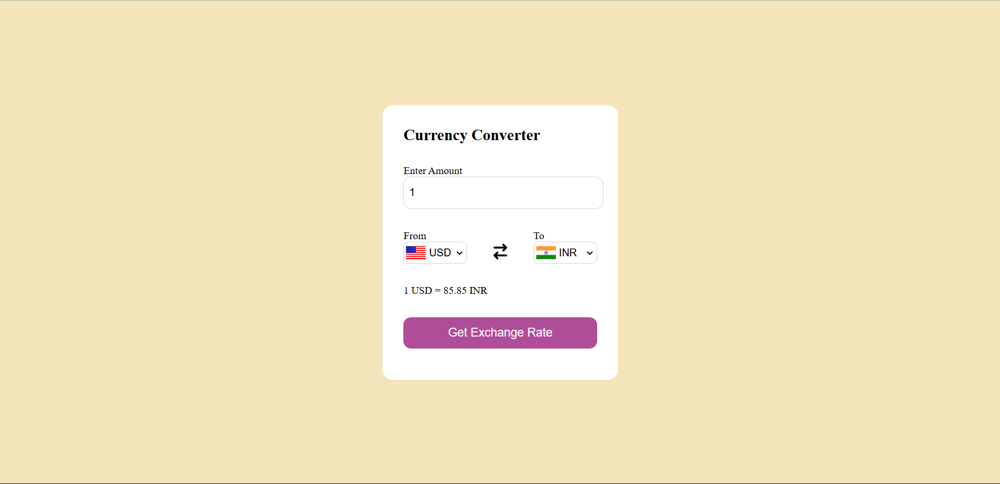
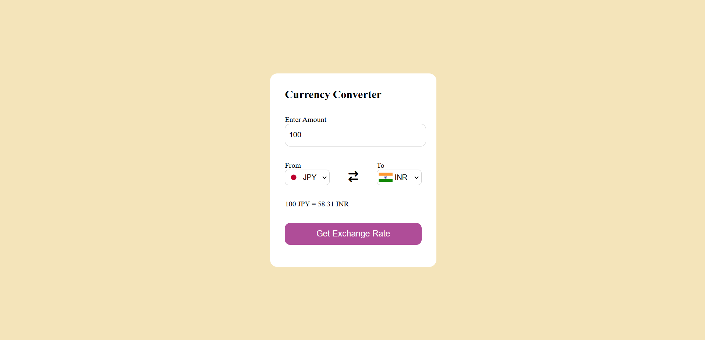

# 💱 Currency Converter Web App

A responsive **Currency Converter** web application built using **HTML**, **CSS**, and **JavaScript**. It allows users to convert any amount between global currencies using real-time exchange rates fetched from the **Open Exchange Rate API** (`open.er-api.com`). The app also displays country flags based on the selected currency codes.

## 🚀 Features

- ✅ Real-time currency exchange rates  
- 🌍 Supports over 150 global currencies  
- 🏳️ Country flags update dynamically  
- 💡 Input validation for user-friendly experience  
- 📱 Responsive design

## 🛠️ Tech Stack

- HTML5  
- CSS3  
- JavaScript (Vanilla JS)  
- [Open Exchange Rate API](https://open.er-api.com/) (No API key required)  
- [Flags API](https://flagsapi.com/) for currency flags

---

## 📂 Screenshots

### USD to INR Conversion

### JPY to INR Conversion

## 🔗 Live Demo

👉 [Click here to try Currency Converter](https://Varshaurs07.github.io/Currency-Converter/)
